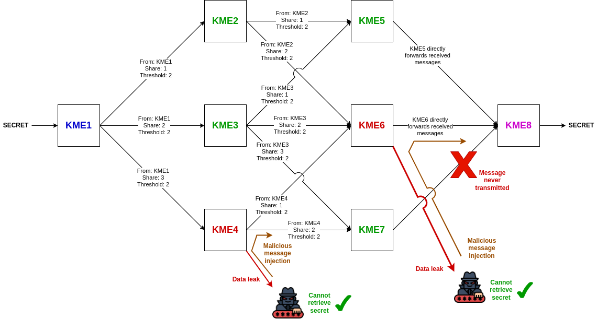

# Inter KME key distribution algorithm for ETSI QKD protocol

*This repository contains the implementation of the Inter KME key distribution algorithm for the
[ETSI QKD standard protocol](assets/etsi_qkd_standard_definition.pdf).*

---

## Introduction

In its proposed standard for a QKD protocol (**ETSI GS QKD 014 v1.1.1 (2019-02)**), ETSI assumes that all
**Key Management Entities (KME)**, responsible for quantum key distribution (QKD) across all the network, are "safe".
However, the documents says "*how KMEs relay keys securely in a QKD network is outside the scope of the present
document*".

The goal of this repository is to propose a solution for the key distribution problem between KMEs that are not
directly connected via a quantum QKD channel. Furthermore, we are **able here to bypass the assumption that all KMEs are
"safe"**, allowing some of them to be compromised. We also **support the case when some QKD links would be broken**.


## The Inter KME key distribution algorithm

The algorithm basically relies on recursive
[Shamir's secret sharing scheme](https://en.wikipedia.org/wiki/Shamir%27s_secret_sharing) (SSSS).
We chose a threshold of 51% of all shares to be able to recover the secret at each recursion step. For example if a
KME spreads its shares to 5 other KMEs, 3 shares at least are required to recover the secret.

The algorithm is the following, for each KME:
```
if first KME:
    generate a secret
    generate shares for all other KMEs
    send shares QKD-encypted to other KMEs connected with a QKD link
else:
    receive QKD-encrypted shares from all other KMEs directly connected with a QKD link
    for each received share:
        if there is only 1 KME next:
            forward directly the received share to the next KME
        else:
            generate shares of received share for all next KMEs directly connected with a QKD link
            send shares QKD-encrypted to next KMEs
```

The final KME would normally be able to recover the secret by reconstructing the received shares,
even if some QKD links are broken.
Furthermore, in case a minority of KMEs are compromised, they would not be able to recover the secret.


## Implementation

In order to run the implementation, first install the Rust toolchain by following the instructions on
https://www.rust-lang.org/tools/install.

Then, clone this repository and run the following command:
```bash
cargo run
```

The code is implemented in an understandable way in `src/main.rs`.

We simulated the following network topology:



We want to transfer a secret between KME1 and KME8, which are not directly connected via a QKD link.

Connections with existing QKD links are represented by arrows.

Here KME4 and KME6 have been compromised, and link between KME7 and KME8 has been broken, meaning the shares cannot
be sent between them.

However, KME8 is still able to recover the secret, and compromised KME4 and KME6 are not able to recover it.